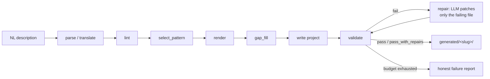

# Workflow-to-Agent Converter (w2a)

A LangGraph app that writes CrewAI apps: describe a business process in plain language, get back a real, runnable multi-agent project — agent roles, tool stubs, an execution flow, a provenance manifest, and a validation report. Code, not a text plan.

```bash
w2a convert examples/workflows/ticket_triage.md --interactive
```

## Why two frameworks

The converter and the code it generates want opposite things, so they use different frameworks on purpose:

- **The converter is a LangGraph pipeline** (`parse → lint → select_pattern → render → gap_fill → write`, with a bounded repair cycle on top). The repair loop — feed a validation failure back to the LLM, patch just the offending file, re-validate — is a conditional-edge cycle, which is exactly what LangGraph is built to express.
- **Generated projects target CrewAI.** CrewAI's declarative surface (role/goal/backstory agents, task lists, `@tool` decorators) is small and regular, which is what you want a code generator emitting — there are few structurally-wrong ways to produce it. Generating free-form LangGraph graphs for arbitrary business processes would multiply the failure surface for no benefit.

See [DECISIONS.md](DECISIONS.md) for the full rationale, including the provider choice and the four load-bearing ideas that keep generation honest.

## Pipeline



`validate` itself runs four tiers in order — static (`py_compile`, `ruff`, AST import-allowlist) → environment (fresh venv, install, import) → execution (`MOCK_MODE=1` dry run) → specificity (domain-noun coverage) — and the repair loop is bounded at 3 iterations before it reports failure honestly rather than looping forever.

## Setup

```bash
python -m venv .venv
.venv/Scripts/activate  # or source .venv/bin/activate on macOS/Linux
pip install -e ".[dev]"
cp .env.example .env  # fill in GEMINI_API_KEY and/or GROQ_API_KEY
```

## CLI

```bash
# Convert a plain-language description into a runnable CrewAI project.
w2a convert examples/workflows/ticket_triage.md --interactive

# Validate (and auto-repair) a generated project.
w2a validate generated/support_ticket_triage_and_reporting

# Convert, validate, and really run the two Field Trial demo workflows
# (ticket triage + PR summary) end to end against committed sample inputs.
w2a demo
```

`w2a demo` is the fastest way to see the whole loop: it translates both benchmark descriptions, generates the projects, runs the validation/repair tiers, and then executes each project for real (real LLM, real sample data) — needs only an API key in `.env`.

## Demo capture

[`docs/demo/`](docs/demo/) has real terminal transcripts (no screen recorder in this environment) of `w2a demo` end to end and of converting/validating two never-before-seen workflow descriptions — one ops, one dev/eng — that were never part of the benchmark set the pipeline was tuned against. See [RESULTS.md's Phase 8 section](RESULTS.md#phase-8--showcase-generalization-on-never-before-seen-input-and-w2a-demo) for the write-up.

## Sample generated projects

Two full generated projects are committed under [`generated/samples/`](generated/samples/) — one ops workflow, one dev/eng workflow — each with its `manifest.json` (provenance: spec, pattern, tool resolutions, LLM calls) and `validation_report.json` (tier results, repair count, verdict) alongside the generated code, so you can browse the output without running anything.

## Honest limitations

This project validates by actually executing generated code, not by eyeballing that it looks plausible — which means the failure modes below are measured, not guessed at. Full detail in [RESULTS.md](RESULTS.md).

- **The closed tool registry is ops-shaped.** Built-in tools are generic office automation (file I/O, HTTP GET, CSV parsing, markdown reports, an outbox folder). Every dev/eng tool mention (GitHub API, git diff, a bug tracker) resolves to an explicit `MOCK_MODE` stub with a TODO, never a real implementation — there's no dev/eng-specific builtin yet (a deliberate, documented scope cut, not an oversight).
- **`MockLLM.supports_function_calling()` is `False`.** CrewAI never invokes tools under `MOCK_MODE=1`, so the mock-mode execution tier proves a crew *runs* but not that it *calls its tools*. Real tool-call-mediated artifacts only appear in real-mode runs.
- **Translation is non-deterministic.** The same benchmark description can render as a slightly different spec/pattern across runs (a real LLM, not a fixture). Regression fixtures in `tests/fixtures/specs/` pin one known-good translation per benchmark so drift is visible, not silent.
- **Ambiguous input is deliberately not auto-resolved.** A vague description ("just handle my support stuff") triggers clarify-mode instead of a confabulated spec — by design, but it means `w2a convert` isn't fully non-interactive for underspecified input; use `--interactive` or expect an exit code asking you to refine the description.

## Design decisions and results

- [DECISIONS.md](DECISIONS.md) — the four load-bearing ideas: the deterministic-template/LLM-gap-fill boundary, the closed tool registry, the bounded repair loop, and the specificity check.
- [RESULTS.md](RESULTS.md) — the full generalization matrix across all 6 benchmark workflows, before/after Phase 7 hardening numbers, and an honest failure gallery.

## Tests

```bash
pytest -k "not benchmark and not vague_input"
```

The full suite includes real fresh-venv installs and real-LLM calls and takes several minutes; CI runs a fast subset (ruff + unit tests + one mock-mode generation smoke test) — see `.github/workflows/`.
